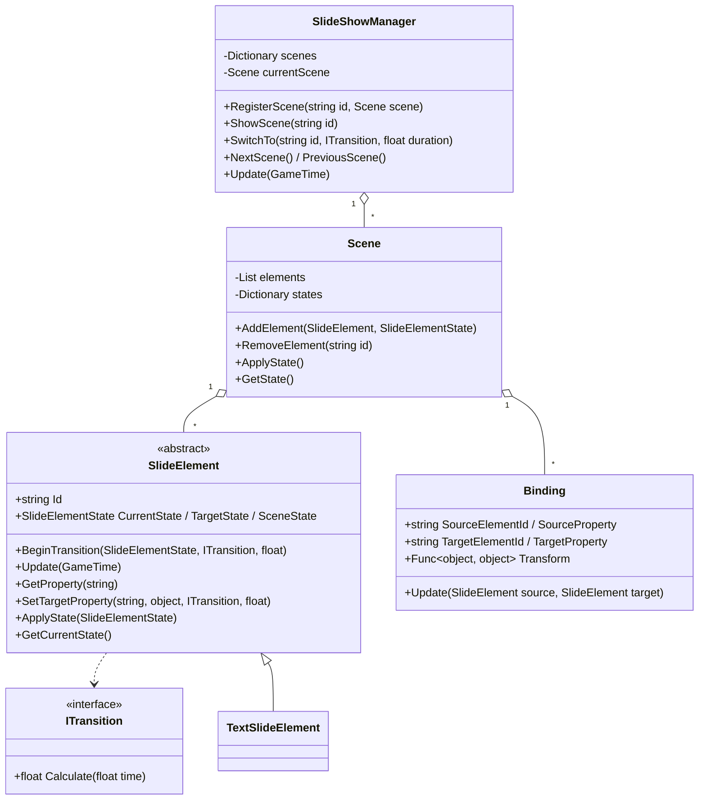

# SlideUI —— 基于 SilkyUI 的"PPT 式"场景管理器模组

## 简介

SlideUI 是一个建立在 **SilkyUIFramework（SilkyUI）** 之上的 Terraria 模组，核心是一个**幻灯片放映（SlideShow）**系统：

- **场景 (Scene)**：每一张"幻灯片"是一个独立场景，包含一组元素及其目标状态。
- **转场 (Transition)**：场景切换时，系统驱动所有共享元素从当前状态平滑过渡到下一场景的目标状态。
- **联动 (Binding)**：元素间状态联动，如按钮悬停触发文本变色、图片放大；回到初始状态时自动恢复场景基准值。
- **内容与代码分离**：场景布局可由 JSON 文件定义；对外提供 `Mod.Call` API 供其他模组调用。

当前版本为**阶段四：JSON 场景定义 + 对外 API + 性能优化**。

## 目录结构

```
ModSources/SlideUI/
├── SlideUI.csproj                  # 项目文件（引用 SilkyUIFramework 前置模组）
├── build.txt                       # modReferences = SilkyUIFramework
├── description.txt
├── SlideUIMod.cs                   # 模组主类
├── Core/                           # ★ 核心框架（与 SilkyUI 完全解耦）
│   ├── ITransition.cs              # 转场算法接口
│   ├── LinearTransition.cs         # 线性插值转场
│   ├── EaseInOutTransition.cs      # 缓入缓出转场（smoothstep）
│   ├── BezierTransition.cs         # 三次贝塞尔转场（含 Ease/EaseIn/EaseOut/EaseInOut 预设）
│   ├── InstantTransition.cs        # 瞬切转场（无过渡，闪现在第一帧完成）
│   ├── SlideElementState.cs        # 元素可动画状态（纯数据类，支持按名读写属性）
│   ├── SlideElement.cs             # 元素抽象基类（每元素独立转场时间线）
│   ├── Scene.cs                    # 场景容器（元素 + 状态快照 + 联动绑定）
│   ├── Binding.cs                  # 元素联动（源属性 → 目标属性，transform 映射）
│   └── SlideShowManager.cs         # 总控制器（单例）
├── Elements/                       # SilkyUI 集成层
│   ├── TextSlideElement.cs         # 文本元素（EffectTextView）
│   ├── ImageSlideElement.cs        # 图片元素（SUIImage）
│   ├── ShapeSlideElement.cs        # 形状元素（UIView 圆角面板）
│   └── ButtonSlideElement.cs       # 按钮元素（UIElementGroup + 悬停/点击事件）
├── Effects/                        # ★ 文本特效（逐字符，独立于场景转场）
│   ├── EffectTextView.cs           # 逐字符自绘 + 自动换行的文本控件（PPT 文本框式）
│   ├── TextEffects.cs              # 抖动 / 打字机特效 + TextEffects 容器
│   └── ColorCycleEffect.cs         # 变色特效（平滑 / 突变）
├── UI/
│   └── SlideShowBody.cs            # 演示用全屏幻灯片主体（从 JSON 加载场景）
├── Content/
│   ├── SceneJsonLoader.cs          # JSON 场景加载器（内容与代码分离）
│   └── scenes.json                 # 4 页场景布局数据
└── Systems/
    └── SlideShowSystem.cs          # 每帧驱动动画 + 快捷键
```

> `Core/` 下所有类**不引用任何 SilkyUI 类型**，只操作纯数据 `SlideElementState`。
> SilkyUI 的耦合被隔离在 `Elements/` 与 `UI/SlideShowBody` 中，
> 未来 SilkyUI 重构时只需适配这几个文件。

## 架构



## 运行与构建

### 前置条件

1. 安装 **SilkyUIFramework** 前置模组（源码已克隆到 `ModSources/SilkyUIFramework-main/`，依赖 `SilkyUIAnalyzer`）。
2. 本机 tModLoader 版本：2026.06（net8.0）。

### 构建顺序

```powershell
# 1. 先构建 SilkyUIFramework（其 csproj 引用了 SilkyUIAnalyzer）
cd "ModSources/SilkyUIFramework-main/SilkyUIFramework-main"
dotnet build SilkyUIFramework.csproj -c Debug
# 生成 Mods/SilkyUIFramework.tmod 与 bin/Debug/net8.0/SilkyUIFramework.dll

# 2. 再构建 SlideUI
cd "ModSources/SlideUI"
dotnet build SlideUI.csproj -c Debug
# 生成 Mods/SlideUI.tmod
```

> `SlideUI.csproj` 通过 `HintPath` 引用 SilkyUIFramework 的编译产物
> （`bin/Debug/net8.0/SilkyUIFramework.dll`，`Private=false` 不打包），
> 运行时类型由前置模组提供。

### 演示方法（内容由特定事件唤起加载）

场景不再随界面启动自动加载，而是由**特定事件**唤起 `LoadJson` 加载**指定 JSON**（可随时切换 / 卸载）：

1. 在 tModLoader 的"模组"界面中启用 `SilkyUIFramework` 与 `SlideUI` 并重载。
2. 进入一个世界。
3. 按 **L** 加载 `Content/scenes.json`（4 页主版式）；按 **J** 加载 `Content/scenes2.json`（2 页备用版式）；按 **U** 卸载全部场景（幻灯片停止、视图隐藏）。
4. 加载后：按 **← / →** 顺序翻页（到首尾即止，不循环），或点击底部 **页码按钮** 一键跳转到第 N 个场景（页码按注册顺序，加载不同 JSON 后自动对应新场景）。
5. 悬停页码按钮触发标题变色 / 图片放大（联动 Binding，由 JSON 定义）；文本特效（抖动 / 打字机 / 变色）也由 JSON 根级 `effects` 配置。

> 卸载也会在世界退出时自动触发，避免残留到下一个世界。外部模组可用 `Mod.Call("LoadJson", path)` / `Mod.Call("UnloadScenes")` 驱动。

> **显隐机制**：元素通过 `SlideElement.SetVisible(bool)` 整体显隐（内部用 SilkyUI 的 `UIView.Invalid`，
> 让整棵视图子树脱离布局/更新/绘制/鼠标命中）。初次进入世界或卸载后舞台完全空白，不会残留文字 / 边框等子属性；
> 加载并 `ShowScene` 时，场景内元素自动可见，未出现在 JSON 中的元素保持隐藏。

## 文本特效（逐字符，独立于场景转场）

文本元素包装的是 `Effects/EffectTextView`（`UITextView` 的扩展），文本的换行与绘制由它接管，
从而支持**逐字符特效**与 **PPT 文本框式自动换行**。特效不依赖场景切换，由元素每帧推进。

### 自动换行（PPT 文本框式）

- 当元素的 `size` 在 JSON 中给定宽高时，文本框使用**固定宽度 + 自动换行**，高度随内容增长；
  单个超长词放不下时允许溢出（除非边界装不下）。未指定 `size` 时自然适配内容（单行）。
- 由 `TextSlideElement.ApplyState` 依据 `state.Size` 自动切换 `FitWidth` / `WordWrap`，无需手动设置。

### 三种特效（通过代码在元素上配置，`TextEffects`）

| 特效 | 关键参数 | 说明 |
| ---- | ---- | ---- |
| `ShakeEffect` | `Amplitude` 幅度、`Period` 每次抖动时长、`Style`（`Jitter` 随机颤抖 / `Bounce` 上下跳动 y=|sin x|）、`CharacterOffset` 错峰相位 | 逐字符偏移 |
| `TypewriterEffect` | `Interval` 放置下一个字符前等待（秒） | 文本变化时自动从头打字 |
| `ColorCycleEffect` | `Colors` 颜色数组、`Period` 走完数组时长、`Smooth` 平滑/突变、`CharacterOffset` 彩虹波相位 | 逐字符变色 |

每个特效继承 `TextEffect`，可设置 `Start` / `Length` 让特效**只作用于文本的一部分**（默认整段）。

```csharp
// 示例：让标题前 2 个字符随机颤抖，副标题打字机 + 平滑彩虹变色
titleView.Effects.CharShake = new ShakeEffect { Amplitude = 4f, Period = 0.1f, Length = 2 };
subtitleView.Effects.Typewriter = new TypewriterEffect { Interval = 0.07f };
subtitleView.Effects.ColorCycle = new ColorCycleEffect
{
    Colors = new[] { Color.Gold, Color.OrangeRed, Color.LightSkyBlue },
    Period = 2.4f, Smooth = true, CharacterOffset = 0.05f,
};
```

### 元素级抖动（整体抖动，基类适用）

抖动分两层，可叠加：

- **整体抖动**：元素基类 `SlideElement.Shake`，对**所有元素类型**生效（文本 = 整个文本框偏移；图片 / 形状 / 按钮 = 整个元素偏移）。
- **逐字符抖动**：`EffectTextView.Effects.CharShake`，仅文本独有，只偏移字符本身。

文本元素可同时启用两者（整体动 + 字符内部各自动）。每个元素因 `Id` 不同而自动错峰：

```csharp
// 非文本元素：整体抖动
imageElement.Shake = new ShakeEffect { Amplitude = 5f, Period = 0.6f, Style = ShakeStyle.Bounce };

// 文本元素：整体抖动 + 逐字符抖动叠加
titleElement.Shake          = new ShakeEffect { Amplitude = 2f, Period = 0.12f, Style = ShakeStyle.Jitter };
titleView.Effects.CharShake = new ShakeEffect { Amplitude = 6f, Period = 0.5f, Style = ShakeStyle.Bounce };
```

## JSON 场景定义（内容与代码分离）

场景布局数据放在 `Content/scenes.json`，由 `SceneJsonLoader` 在运行时解析。元素（视图与类型）由代码定义，JSON 只描述**每个元素在每张"幻灯片"中的状态**：

```json
{
  "scenes": [
    {
      "id": "intro",
      "transition": "easeout",    // 本场景默认转场（可省略）
      "duration": 1.0,             // 本场景默认转场时长（可省略）
      "elements": [
        { "id": "title", "position": ["10%", "14%"], "scale": 1.0, "color": "#FFFFFF", "text": "第一页" },
        { "id": "card",  "position": ["10%", "38%"], "size": ["52%", "44%"], "color": "#141A2E",
          "borderRadius": 14, "border": 2, "borderColor": "#59FFFFFF" }
      ],
      "bindings": [
        { "source": "page1", "target": "title", "targetProperty": "Color", "value": "#FF4500", "duration": 0.15 },
        { "source": "page1", "target": "image", "targetProperty": "Scale", "value": [1.35, 1.35], "duration": 0.15 }
      ]
    }
  ]
}
```

- 坐标/尺寸支持 `"10%"`（相对屏幕）或 `"192"` / `"192px"`（绝对像素）；
- `scale` / `borderRadius` 可以是单个数字（均匀）或数组；
- 颜色支持 `#RRGGBB` / `#RRGGBBAA`；
- `transition` 支持 `linear` / `easeinout` / `ease` / `easein` / `easeout` / `instant`（瞬切，无过渡）；
- `border` / `borderColor` 仅对形状/按钮元素生效，负 `border` 表示不改变；
- `bindings` 定义场景内联动：`source`（通常是按钮的 `IsHovered`，可省略 `sourceProperty`）→ `target` 元素的 `targetProperty`；悬停时套用 `value`，移开自动恢复该场景的基准状态。

### JSON 特效（根级 `effects`，与场景无关）

特效与场景切换无关，放在 JSON **根级**，按元素 Id 配置（元素跨场景共享，因此全局生效一次）：

```json
{
  "scenes": [ ... ],
  "effects": {
    "title": {
      "shake":     { "amplitude": 4,  "period": 0.24, "style": "jitter" },   // 整体抖动（所有元素）
      "charShake": { "amplitude": 12, "period": 1,    "style": "bounce" }    // 逐字符抖动（仅文本）
    },
    "subtitle": {
      "charShake":  { "amplitude": 3, "period": 0.3, "style": "jitter" },
      "typewriter": { "interval": 0.14 }
    },
    "hint": {
      "colorCycle": { "colors": ["#FFD700", "#87CEFA", "#FF4500"], "period": 4.8, "smooth": true, "start": 0, "length": 8 }
    },
    "image": {
      "shake": { "amplitude": 10, "period": 1.2, "style": "bounce" }
    }
  }
}
```

- `shake` = 整体抖动（`SlideElement.Shake`，任意元素类型）；`charShake` / `typewriter` / `colorCycle` = 逐字符特效（仅文本元素）。
- 通用字段：`enabled`（bool）、`start` / `length`（作用于文本的一部分，`length` 负数 = 到末尾）。
- `shake`：`amplitude`（幅度）、`period`（每次抖动时长，秒）、`style`（`jitter` 随机颤抖 / `bounce` 上下跳动）、`characterOffset`（错峰相位）。
- `typewriter`：`interval`（放置下一个字符前等待，秒）。
- `colorCycle`：`colors`（`#RRGGBB` 数组）、`period`（走完数组时长）、`smooth`（平滑 / 突变）、`characterOffset`（彩虹波相位）。

## 对外 API（Mod.Call）

其他模组可通过 `ModLoader.GetMod("SlideUI").Call(...)` 驱动幻灯片：

| 调用 | 参数 | 返回 |
| ---- | ---- | ---- |
| `"SwitchTo"` | `string sceneId, [ITransition], [float duration]` | `bool` |
| `"ShowScene"` | `string sceneId` | `bool` |
| `"NextScene"` | — | `bool` |
| `"PreviousScene"` | — | `bool` |
| `"LoadJson"` | `string jsonPath`（如 `"Content/scenes2.json"`） | `bool`：由事件唤起，加载指定 JSON 并替换当前场景 |
| `"UnloadScenes"`（或 `"Unload"`） | — | `bool`：卸载全部场景（幻灯片停止） |
| `"GetCurrentScene"` | — | `string`（当前页 Id） |
| `"IsTransitioning"` | — | `bool` |

示例：`ModLoader.GetMod("SlideUI")?.Call("LoadJson", "Content/scenes2.json")`

## 阶段路线图

| 阶段 | 内容 | 状态 |
| ---- | ---- | ---- |
| 一 | 基础框架：Manager / Scene / SlideElement / TextSlideElement / LinearTransition | ✅ 已完成 |
| 二 | Image / Shape / Button 元素、Bezier / EaseInOut 转场、完善状态快照 | ✅ 已完成 |
| 三 | Binding 联动系统（悬停变色 / 图片放大，恢复场景基准值） | ✅ 已完成 |
| 四 | JSON 场景定义、`Mod.Call` 对外 API、性能优化 | ✅ 已完成 |
